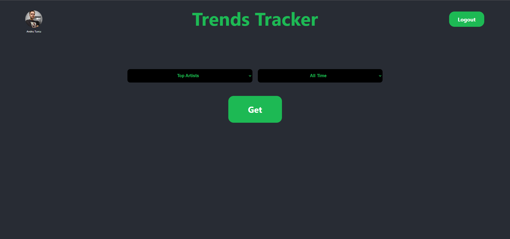
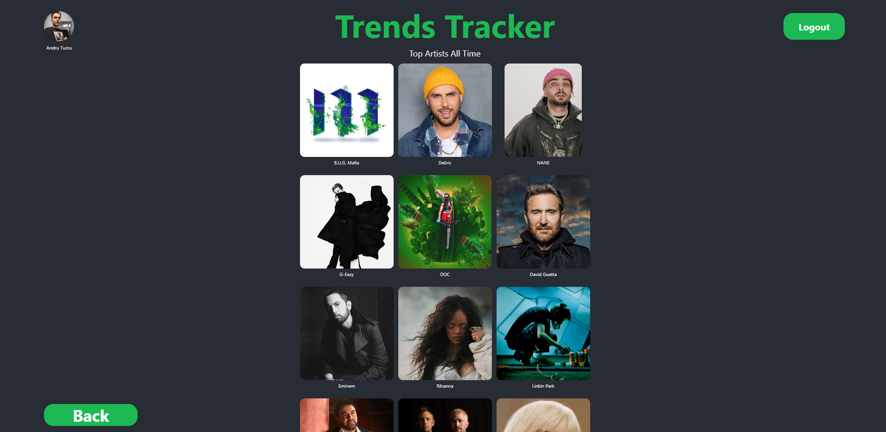

# Trends Tracker

This project makes use of the public Spotify API to track the most played artists or tracks by a user. To run the app, use `npm start` in the project directory and head to [http://localhost:3000](http://localhost:3000).

This project was bootstrapped with [Create React App](https://github.com/facebook/create-react-app).

## Screenshots

